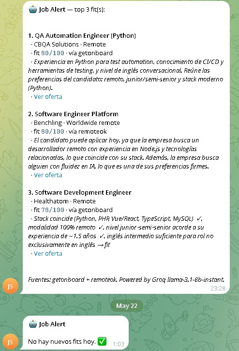

**[English](README.md) · [Español](README.es.md)**

---

# Job Alert Agent

[](https://github.com/sebpost2/job-alert-agent/actions/workflows/ci.yml)
[](https://github.com/sebpost2/job-alert-agent/actions/workflows/pipeline.yml)
[](https://github.com/sebpost2/job-alert-agent/actions/workflows/digest.yml)

Agent that every 12 hours scrapes job postings from [getonboard](https://www.getonbrd.com) and [RemoteOK](https://remoteok.com), scores them against my CV using an LLM, archives the relevant ones in a Notion database, and sends a daily Telegram digest with the best fits of the day.

Built as a portfolio piece to showcase end-to-end LLM automation, deployed completely free via GitHub Actions cron.

Author: [sebpost2](https://github.com/sebpost2)

---

## The agent running

> 📋 **Live dashboard (public Notion)** → **[bevel-rose-8cb.notion.site/Job-Alerts](https://bevel-rose-8cb.notion.site/Job-Alerts-3674d098c1e7807aafe0cf6a3507e526)**
> Every job the agent classified as `fit` or `stretch` shows up there with score, reason, source and link to the offer. The `skip` ones stay in Postgres for auditing.
>
> 🔁 **How to verify it works**: the badges above show the cron status in green. The repo's [Actions](../../actions) tab keeps the public log of every run — scrape, score, sync and digest.
>
> 📲 **Telegram**: the daily digest sends the top N fits (default 3) and marks each one as notified so it doesn't spam duplicates.

<p align="center">
  
  <br>
  <em>The bot's digest — top 3 fits with score, source, reason and link. When everything is already sent, it replies "No new fits today".</em>
</p>

## Highlights

- **End-to-end automated**: GitHub Actions cron fires → Python scrapes 2 sources → LLM scores fit → Postgres dedupes → Notion archive + Telegram digest. Zero human input.
- **LLM with structured output**: every job is evaluated by Groq (`llama-3.1-8b-instant`), forcing JSON with `fit_score` (0-100), `verdict` (`fit`/`stretch`/`skip`) and `reason`. Specific reasons, not generic.
- **Smart rate-limit throttle**: respects Groq's free-tier 6000 TPM with a minimum interval between calls, keeping the system inside quota without crashing.
- **CV-aware**: the system prompt includes a structured candidate summary (stack, seniority, geo, language) — the LLM doesn't score "is this a good role" in the abstract, it scores "does it fit THIS candidate".
- **Two commands, one architecture**: `python -m job_alert scrape` + `score` (every 12h) and `digest` (daily 8am Lima). Composable, individually testable.
- **Battle-tested**: [168 unit + integration tests](./tests) under [`pytest`](./pyproject.toml), **97% line+branch coverage** gated at 90% in CI, 100% typed under [`mypy --strict`](./pyproject.toml), enforced on every push by [GitHub Actions CI](./.github/workflows/ci.yml). Suite runs in ~4s with zero network and zero DB.
- **Analytics + data quality offline**: `analytics-export` snapshots the `jobs` table to Parquet, DuckDB queries it in place (fit rate by source, score distribution, top companies), and a pydantic schema flags rows that violate domain invariants — all under the same mypy strict + coverage gate.
- **100% permanently free stack**: GitHub Actions cron + Neon Postgres + Groq LLM + Notion API + Telegram bot. Zero cost, zero trial.

## Stack

| Layer | Technology |
|---|---|
| Language | Python 3.12+ |
| HTTP | `httpx` (async) |
| Database | PostgreSQL (Neon, serverless) |
| DB driver | `asyncpg` |
| LLM | Groq llama-3.1-8b-instant |
| LLM SDK | Official `groq` |
| Notion | Direct HTTP API via `httpx` |
| Telegram | Direct Bot API via `httpx` |
| Snapshot format | Apache Parquet via `pyarrow` |
| Analytics engine | DuckDB (in-memory, reads Parquet in place) |
| Data quality | `pydantic` v2 with custom model validators |
| TLS trust store | `truststore` (system store, not certifi) |
| Orchestration | GitHub Actions cron |

## How it works

```
┌──────────────────────┐     ┌─────────────────────────────────────┐
│ GitHub Actions cron  │────▶│ python -m job_alert scrape          │
│ */12h: scrape+score  │     │   ├─ getonboard (public JSON API)   │
│ daily 8am: digest    │     │   └─ remoteok   (public JSON API)   │
└──────────────────────┘     │           ↓                         │
                             │   upsert by url → Neon Postgres     │
                             └─────────────────────────────────────┘
                                          ↓
                             ┌─────────────────────────────────────┐
                             │ python -m job_alert score           │
                             │   loop unscored jobs:               │
                             │   ├─ regex pre-filter (non-IT, lead)│
                             │   │   → skip without LLM call       │
                             │   ├─ Groq llama-3.1-8b-instant      │
                             │   │   (json_object with CV+keywords)│
                             │   ├─ 8s throttle between calls (TPM)│
                             │   └─ save fit_score/verdict/reason  │
                             └─────────────────────────────────────┘
                                          ↓
                             ┌─────────────────────────────────────┐
                             │ python -m job_alert digest          │
                             │   ├─ sync fit+stretch → Notion DB   │
                             │   └─ top N un-notified fits →       │
                             │       Telegram bot (HTML parse_mode)│
                             └─────────────────────────────────────┘
```

## Analytics & data quality

A second, offline pipeline lives under [`job_alert/analytics/`](./job_alert/analytics) for introspecting the scraped data without touching the live DB:

```bash
python -m job_alert analytics-export    # snapshot Postgres → data/jobs_YYYYMMDD.parquet
python -m job_alert analytics-quality   # validate the latest snapshot with pydantic
python -m job_alert analytics-report    # DuckDB queries: fit rate, distribution, top companies
```

- **`export.py`** writes the full `jobs` table as a Parquet file with an explicit pyarrow schema (no type inference; drifts surface immediately).
- **`schema.py`** defines a `JobRow` pydantic v2 model whose `model_validator`s encode domain invariants — fit_score in `[0,100]`, verdict in `{fit,stretch,skip}`, scoring is atomic (fit_score/verdict/scored_at all set or all null), `notified_at` only on `fit` and never before `scored_at`, `posted_date` not in the future.
- **`quality.py`** reads the Parquet and validates each row through `JobRow`, returning a `QualityReport(total, valid, invalid, errors)` for inspection.
- **`analyze.py`** runs DuckDB SQL on the Parquet in place (`read_parquet(path)` — no ETL, no staging) and renders a markdown report.

Sample `analytics-report` output (real fixture data):

```
# Analytics — jobs_20260523.parquet (1247 rows)

## Fit rate by source
| source     | total | fit | stretch | skip | unscored | fit_rate |
| getonboard |   650 |  78 |     145 |  427 |        0 |  12.00%  |
| remoteok   |   597 |  42 |      89 |  466 |        0 |   7.04%  |

## Score distribution
| bucket   | count |
| 80-100   |    22 |
| 60-80    |    98 |
| 40-60    |   178 |
| 20-40    |   239 |
| 0-20     |   654 |
```

Design choice: pydantic + DuckDB + Parquet over Great Expectations. GE is config-driven and opinionated for large enterprise data warehouses; for a single-table portfolio project, defining invariants as code in pydantic is simpler, fully typed under mypy strict, easier to test, and demonstrates understanding of the validation pattern itself (which transfers to FastAPI, LangChain, OpenAI SDK, etc.) rather than configuration of one specific tool.

## Tests & type checking

[](https://github.com/sebpost2/job-alert-agent/actions/workflows/ci.yml)

The whole package is covered by **168 [`pytest`](./tests) tests** with **97% line+branch [coverage](./pyproject.toml)** (gated at 90% in CI — the build fails if it drops below), and type-checked under **[`mypy --strict`](./pyproject.toml)**. The [CI workflow](./.github/workflows/ci.yml) runs all three on every push and PR — click the badge to see the latest run (the log prints `Required test coverage of 90% reached. Total coverage: 97.xx%`).

```bash
pip install -r requirements-dev.txt

python -m mypy        # strict type checking, zero errors required
python -m pytest      # 113 tests + coverage report, ~4 seconds
```

Layout (every file under [`tests/`](./tests) is browsable on GitHub):

```
tests/
├── conftest.py                       # shared Config fixture
├── test_config.py                    # env-var loading + validation
├── test_scorer_pure.py               # hard-skip regex + prompt assembly
├── test_scorer_llm.py                # Groq client mocked with AsyncMock
├── test_db.py                        # asyncpg.Connection mocked, SQL shape verified
├── test_notion_sync_pure.py          # property builder for Notion pages
├── test_notion_sync_http.py          # full sync flow with respx-mocked HTTP
├── test_telegram_format.py           # HTML escaping + digest layout
├── test_telegram_digest_http.py      # send_digest with respx
├── analytics/
│   ├── test_schema.py                # pydantic JobRow — every invariant tested
│   ├── test_export.py                # Postgres → Parquet, schema lock + roundtrip
│   ├── test_analyze.py               # DuckDB queries on fixture Parquet
│   └── test_quality.py               # validation report on mixed valid/invalid data
└── sources/
    ├── test_getonboard_normalize.py  # JSON → canonical job dict
    ├── test_getonboard_http.py       # paginated fetch with respx
    ├── test_remoteok_normalize.py
    └── test_remoteok_http.py
```

Design choices:
- **No real DB or network in CI** — `asyncpg.Connection` is replaced with `AsyncMock`, HTTP is mocked with `respx`, Groq is mocked by patching `AsyncGroq`. The suite runs deterministically in ~3 seconds on a free GitHub Actions runner.
- **mypy strict from day one** — `disallow_untyped_decorators`, `no_implicit_reexport`, `warn_return_any` all on. Third-party untyped modules (`asyncpg`, `truststore`, `respx`) are explicitly allow-listed in `pyproject.toml`.
- **Tests are the spec for normalizers** — every field the scraper writes to Postgres is asserted, so silent schema drift breaks CI before it hits production.

## Design decisions

- **GitHub Actions over n8n**: the original plan was n8n cloud (visual workflow), but they discontinued the free tier in 2026. GitHub Actions is permanently free and the public logs are themselves a signal that the system runs reliably — better than a static n8n screenshot.
- **`llama-3.1-8b-instant` over `gpt-oss-120b`**: the 120b has better reasoning but only 8000 TPM and supports `json_schema`; the 8b has enough reasoning to classify fits, supports `json_object` mode, and similar TPM. Both hit the same ceiling here; 8b wins on latency.
- **Regex pre-filter before the LLM**: getonboard mixes medical, sales, marketing, HR roles, etc. A cheap regex on the title discards the obvious non-IT and `staff/principal/director` postings without spending a Groq call. Cuts ~25-30% off per-cycle cost.
- **Only `fit`+`stretch` go to Notion**: `skip` rows stay in Postgres. The Notion DB ends up with 8-12 relevant rows per cycle instead of 130 — usable as an actual application board, not a log.
- **Explicit throttle (8s between calls)**: the Groq SDK retries on 429 but with high concurrency every retry hits TPM again. Better to control pacing client-side and never touch the limit.
- **Direct Notion API (`httpx`) over `notion-client`**: the official SDK v3.x removed `databases.query()` and pushes migrating to `data_sources.query()` (in flux). Talking to the stable HTTP endpoint is simpler and more stable.
- **Telegram with `parse_mode=HTML`**: `MarkdownV2` requires escaping EVERY special character, even inside URLs. HTML only needs `< > &`. For messages full of punctuation, HTML is far less painful.
- **CV compressed to ~200 tokens**: the full LaTeX CV costs ~2000 tokens per call. The dense version (`cv_summary.py`) brings that down to ~400 without losing what matters to evaluate fit: stack, seniority, geo, preferences.
- **`truststore` for TLS**: a no-op in CI; on local Windows with antivirus that intercepts TLS (Avast, Kaspersky), it avoids the endless `CERTIFICATE_VERIFY_FAILED` drama.
- **Neon DB shared with other projects**: instead of spinning up another Neon project, I added the `jobs` table to the same instance my receipt projects use. Different domains, shared infra — common in production.

## Running locally

### Requirements

- Python 3.11+
- A Postgres DB (recommended: [Neon](https://neon.tech) free tier)
- Free [Groq](https://console.groq.com) account
- Telegram bot (via [@BotFather](https://t.me/BotFather))
- Notion internal integration + a database created and connected

### Setup

```bash
git clone https://github.com/sebpost2/job-alert-agent
cd job-alert-agent

python -m venv .venv
.venv\Scripts\activate         # Windows
# source .venv/bin/activate    # Linux/Mac

pip install -r requirements.txt
```

Copy `.env.example` to `.env` and fill in the values. Then apply the migration:

```bash
python scripts/apply_migration.py
```

### Usage

```bash
# Scrape new jobs into the DB
python -m job_alert scrape

# Score the pending ones (~8s per job due to TPM throttle)
python -m job_alert score

# Sync to Notion + send Telegram digest
python -m job_alert digest

# Shortcuts
python -m job_alert pipeline   # scrape + score
```

## Environment variables

| Variable | Description |
|---|---|
| `DATABASE_URL` | PostgreSQL connection string |
| `GROQ_API_KEY` | Groq API key |
| `NOTION_TOKEN` | Internal integration token |
| `NOTION_DB_ID` | UUID of the Notion database |
| `TELEGRAM_TOKEN` | Bot token |
| `TELEGRAM_CHAT_ID` | Your chat ID (get it via `/getUpdates`) |
| `KEYWORDS` | CSV list of keywords to bias the LLM, e.g. `python,ai,remote` |
| `DIGEST_TOP_N` | How many fits to include in the digest (default `3`) |
| `MIN_FIT_SCORE` | Minimum score for a fit to appear in the digest (default `60`) |

In GitHub Actions these go under `Settings → Secrets and variables → Actions`. `KEYWORDS` can go as a `Variable` (not a secret).

## Project structure

```
├── .github/workflows/
│   ├── pipeline.yml     # cron 12h: scrape + score
│   └── digest.yml       # cron 8am: digest
├── job_alert/
│   ├── __main__.py      # CLI dispatcher
│   ├── config.py        # early env-var validation
│   ├── db.py            # asyncpg + queries
│   ├── cv_summary.py    # compressed CV for the prompt
│   ├── scorer.py        # Groq with json_object + throttle
│   ├── notion_sync.py   # upsert via httpx → Notion API
│   ├── telegram_digest.py
│   ├── analytics/
│   │   ├── schema.py    # pydantic JobRow + data quality invariants
│   │   ├── export.py    # Postgres → Parquet snapshot (pyarrow)
│   │   ├── quality.py   # validate Parquet rows against JobRow
│   │   └── analyze.py   # DuckDB queries + markdown report
│   └── sources/
│       ├── getonboard.py
│       └── remoteok.py
├── migrations/001_init.sql
├── scripts/
│   ├── apply_migration.py
│   └── archive_notion_skips.py  # one-shot housekeeping
└── requirements.txt
```

## Known limitations

- **No cross-run retries**: if `score` fails mid-execution (LLM or DB exception), the un-scored jobs wait for the next cron. Not ideal but the 12h cron picks them up fast.
- **Notion `databases.query` deprecated**: Notion's API is migrating to `data_sources.query`. The official `notion-client` library still uses the old endpoint and works, but warnings will appear over time.
- **RemoteOK only sends 100 jobs**: if the cron skips several days in a row it could miss offers. Not an issue for continuous use.
- **No client-side geo filtering**: filtering US-only/EU-only is the LLM's job inside the scorer. Good enough in practice but the LLM occasionally misses.

---

Built by [sebpost2](https://github.com/sebpost2) as an AI-automation portfolio piece. Sources: [getonboard](https://www.getonbrd.com), [RemoteOK](https://remoteok.com) (thanks for the public API).
